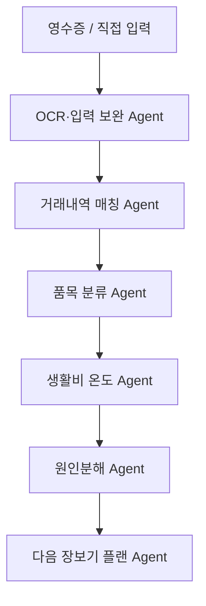

# 머니센스 MoneySense

**영수증과 거래내역으로 생활비가 오른 이유를 알려주는 AI 생활금융 Agent**

> iM Challenger 제출용 MVP

## 배포 링크

https://moneysense-tau.vercel.app/

- 데스크톱: 왼쪽 휴대폰 프레임에서 실제 앱을 조작하고, 오른쪽 패널에서 화면별 설명을 함께 볼 수 있습니다.
- 모바일: 앱이 화면 전체를 사용합니다.

---

## 문제 정의

기존 금융 앱은 사용자가 **어디서 얼마를 썼는지** 보여주는 데는 강합니다. 하지만 사용자가 실제로 알고 싶은 것은 **"왜 생활비가 올랐는지"** 입니다.

카드·계좌 내역에는 `iM마트 41,000원`처럼 **가맹점명과 총액만** 남습니다. 그 안에서 우유를 샀는지, 즉석식품을 샀는지, 어떤 품목의 가격이 올랐는지 — 생활비 상승의 실제 원인은 데이터에서 사라집니다.

## 핵심 차별점

**머니센스는 영수증을 자동 입력하는 가계부가 아닙니다.**
**카드내역이 잃어버린 품목 정보를 복원해 생활비 상승 원인을 설명하는 AI 생활금융 Agent입니다.**

| 기존 가계부/OCR 앱 | 머니센스 |
| ------------------ | -------- |
| 영수증을 읽고 지출을 기록 | 영수증과 거래내역을 연결 |
| 어디서 얼마 썼는지 확인 | 무엇을 샀는지 품목 정보 복원 |
| 카테고리별 소비통계 제공 | 생활비 상승 원인분해 |
| 예산 초과 여부 확인 | 다음 장보기 플랜과 지역상생 전환 제안 |

---

## 주요 기능

### 입력
- **영수증 추가**: 샘플 영수증 3종(품목형 / 합계형 / 카드매출전표형) 선택 또는 이미지 업로드(mock OCR 안내 후 샘플 결과 사용)
- **직접 지출 입력**: 날짜·상호·소비처 유형·결제수단·품목·메모 입력, 저장 시 확인 모달
- **빠른 금액 버튼**: +1천원 ~ +10만원 버튼 누적 입력 + 초기화 (품목 금액 입력에도 재사용)
- **합계형 영수증 품목 직접 추가**: 총액만 인식된 영수증에 품목을 채워 분석 정확도 향상
- **카드·계좌 거래내역**: 샘플 불러오기 + 직접 추가
- **영수증 사후 편집/삭제**: 수정하면 매칭·분석 자동 재계산

### 분석 (4단계 리포트)
- **영수증-거래내역 매칭**: 금액(45)·날짜(25)·상호명(20)·결제수단(10) 점수제 매칭, "확인 필요" 건은 사용자가 직접 확정/거절
- **품목 정보 보강**: 총액만 남은 카드내역에 영수증 품목을 연결 (`품목 보강` 상태)
- **생활비 온도**: 기본 35℃ + 가산 요인으로 0~100℃ 계산 (안정/관심/주의/뜨거움)
- **온도 계산 근거**: "왜 이 온도인가요?" — 요인별 가산값의 합계가 곧 온도임을 시각화
- **지난 소비 vs 이번 소비 비교**: 편의점 식비·대표 품목 가격·간편식 횟수·지역가게 비중
- **생활비 원인분해**: 가격 상승 / 구매량 증가 / 소비처 변화 / 조정 가능한 소비 4개 카드 (절약한 주에는 절약 관점으로 자동 전환)
- **다음 장보기 플랜**: 예상 절약 포인트 + 지역상생 전환 제안 (동일 예산 내 동네시장 비중 상향)
- **발표용 요약 카드**: "총액만 남은 카드내역 → 품목 복원 → 원인 → 다음 행동" 흐름을 3문장으로 자동 생성

### 기타
- 지출 증가 데모(77℃ 주의)와 지출 절약 데모(36℃ 안정) 두 가지 샘플 시나리오
- 주간 마감: 이번 주 기록을 다음 주 비교 기준으로 저장 (내 기록 기반 비교)
- localStorage 저장으로 새로고침 후에도 데이터 유지

---

## AI Agent 흐름



| Agent | 역할 | 현재 구현 (`lib/services/mockAi.ts`) |
| --- | --- | --- |
| OCR·입력 보완 | 영수증에서 품목·금액 추출, 흐릿하면 직접 입력 유도 | `mockParseReceipt` (mock OCR) |
| 거래내역 매칭 | 금액·날짜·상호·결제수단 점수제로 영수증과 거래 연결 | `matchReceiptsToTransactions`, `applyMatchOverrides` |
| 품목 분류 | 품목을 필수식료품/간편식/간식·음료 등으로 분류 | `classifyItem` (룰 기반) |
| 생활비 온도 | 가산 요인을 합산해 0~100℃ 온도 계산 | `calculateTemperature`, `buildTemperatureBreakdown` |
| 원인분해 | 상승(또는 절약) 원인을 4가지로 분해하고 지난 소비와 비교 | `analyzeCauses`, `buildComparisons` |
| 장보기 플랜 | 절약 + 지역상생 전환 제안, 발표용 요약 생성 | `generateActionPlans`, `generatePresentationSummary` |

> 현재 MVP는 실제 OCR/LLM/금융 API 대신 **mock adapter와 계산 로직**으로 Agentic workflow를 검증했습니다. 각 함수의 시그니처를 유지한 채 내부만 교체하면 실제 API로 확장할 수 있습니다. (자세한 내용: [docs/architecture.md](docs/architecture.md))

---

## 데모 시나리오

1. 홈에서 **"지출 증가 데모"** 를 실행합니다.
2. 카드내역에 **iM마트 41,000원**, **미소24(편의점) 13,800원**이 총액만 남아 있습니다.
3. 영수증을 연결해 우유·계란·세제·즉석식품, 컵라면·에너지드링크·삼각김밥·과자 등 **품목 정보가 보강**됩니다.
4. **샛별시장(동네시장) 22,000원** 현금 소비는 거래내역에 없어 **직접 입력 소비**로 처리됩니다.
5. 생활비 온도 **77℃(주의)** 와 계산 근거(기본 35℃ + 단가 상승 +10℃ + 간편식 증가 +8℃ …)를 확인합니다.
6. 지난 소비와의 비교, 원인분해 4개 카드를 확인합니다.
7. 다음 장보기 플랜과 **지역상생 전환 제안**(동일 예산 내 동네시장 비중 29% → 약 42%)을 확인합니다.

> **"지출 절약 데모"** 를 실행하면 반대로 지난주보다 28,000원을 아낀 주(36℃ 안정)의 절약 요인 분석을 볼 수 있습니다.

---

## 기술 스택

- **Next.js 15** (App Router) + **React 19** + **TypeScript 5**
- **Tailwind CSS 4**
- **lucide-react** (아이콘)
- **localStorage** (DB 없이 상태 저장)
- **mock AI adapter** (`lib/services/mockAi.ts` — 실제 OCR/LLM/금융 API로 교체 가능한 구조)
- **Vercel** (배포)

## 프로젝트 구조

```text
app/                  # Next.js App Router (레이아웃, 페이지, 전역 스타일)
components/           # UI 컴포넌트
  MoneySenseApp.tsx   #   앱 본체 (탭 네비게이션 + 전역 상태 + localStorage)
  ShowcaseLayout.tsx  #   데스크톱: 휴대폰 프레임 + 설명 패널 레이아웃
  ShowcasePanel.tsx   #   화면 연동형 설명 패널 (데스크톱 전용)
  ...                 #   입력 폼, 매칭 결과, 온도/원인/플랜 카드 등
lib/
  types.ts            # 핵심 데이터 타입 (Receipt, Transaction, AnalysisResult 등)
  mockData.ts         # 샘플 데모 데이터 (증가/절약 시나리오)
  labels.ts           # enum 값 → 한국어 라벨 매핑
  services/
    mockAi.ts         # mock AI 함수 모음 (OCR·매칭·온도·원인분해·플랜 생성)
public/               # 정적 리소스
docs/                 # 아키텍처, 확장 계획
```

## 실행 방법

```bash
npm install
npm run dev     # 개발 서버 (http://localhost:3000)
npm run build   # 프로덕션 빌드
npm run lint    # ESLint 검사
```

---

## 현재 MVP 범위

| 영역 | 현재 MVP | 실제 서비스 확장 |
| --- | --- | --- |
| 영수증 인식 | mock OCR / 샘플 영수증 | OCR API |
| 카드·계좌 내역 | 샘플 거래내역 | 금융 API / 마이데이터 연동 |
| 품목 분류 | 룰 기반 + mock AI 함수 | LLM 분류 Agent |
| 원인분해 | 계산 로직 기반 | 개인화 분석 Agent |
| 장보기 플랜 | mock AI 제안 | LLM 추천 Agent |
| 데이터 저장 | localStorage | DB / 사용자 계정 기반 저장 |

## 향후 고도화

- 실제 OCR API 연동
- 금융 마이데이터/카드 API 연동
- LLM 기반 품목 분류 및 요약 생성
- 개인별 반복 구매 품목 기반 생활비 온도 개인화
- 지역상권 데이터 연동
- 사용자별 예산/소비패턴 기반 맞춤 플랜

자세한 확장 계획은 [docs/mvp-vs-production.md](docs/mvp-vs-production.md)를 참고하세요.

---

## 문서

- [AI Agent 아키텍처](docs/architecture.md)
- [MVP vs 실제 서비스 확장 계획](docs/mvp-vs-production.md)

---

> **기존 금융 앱은 어디서 얼마를 썼는지 보여줍니다.**
> **머니센스는 영수증으로 무엇을 샀는지 복원하고, 왜 생활비가 올랐는지 설명하며, 다음 장보기 플랜까지 제안합니다.**
