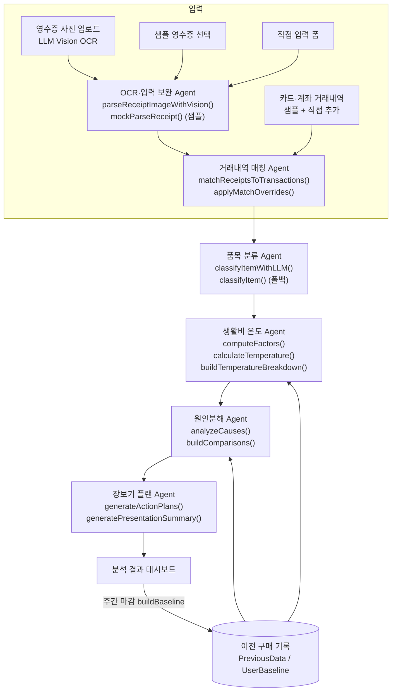

# 머니센스 AI Agent 아키텍처

## 설계 원칙

현재 MVP는 **Agentic workflow의 골격을 mock adapter와 계산 로직으로 먼저 검증**한 뒤, 검증된 교체 지점에 실제 LLM을 단계적으로 연결하고 있다. 영수증 Vision OCR과 직접 입력 품목 분류는 실제 LLM 호출로 동작하며(폴백: 샘플/룰 기반), 금융 API 등 나머지는 같은 방식으로 각 adapter 내부에 연결해 확장한다.

이를 위해 모든 분석 로직을 `lib/services/ai.ts` 한 곳에 모으고, **함수 시그니처(입력/출력 타입)를 유지한 채 내부 구현만 교체**하면 되는 구조로 분리했다. UI 컴포넌트는 `analyzeAll()` 파이프라인의 결과 타입(`AnalysisResult`, `MatchResult`)만 의존하므로, 내부가 mock이든 실제 API든 화면 코드는 바뀌지 않는다.

## 전체 흐름

전체 파이프라인은 `analyzeAll(receipts, transactions, previous, overrides)` 하나로 실행되며, 영수증·거래내역·수동 판정이 바뀔 때마다 React `useMemo`로 자동 재계산된다.

## 각 Agent 역할과 구현

### 1. OCR·입력 보완 Agent — `parseReceiptImageWithVision`, `mockParseReceipt`

| | |
| --- | --- |
| 역할 | 영수증에서 날짜·상호·품목·금액을 추출하고, 인식이 어려우면 직접 입력으로 유도 |
| 현재 MVP | **업로드 사진은 LLM Vision이 실제로 인식** (`app/api/ocr` — 인식과 카테고리 분류를 단일 호출로 수행, 반환 타입 `Omit<Receipt, 'id'>` 유지). 저장 전 확인/수정 화면 제공, 합계 오차·날짜 불명은 플래그로 사용자 확인 유도. 키 없음·오류·영수증 아님은 정직한 안내 후 샘플/직접 입력으로 폴백. 샘플 영수증은 `mockParseReceipt`로 데모 결정성 유지. 이미지는 저장·로깅 없이 즉시 폐기 |
| 실제 서비스 확장 | 전자영수증 제휴 연동으로 무입력(zero-input) 자동 수집 — OCR 자체가 과도기 수단 |

### 2. 거래내역 매칭 Agent — `matchReceiptsToTransactions`, `applyMatchOverrides`

| | |
| --- | --- |
| 역할 | 영수증과 카드·계좌 거래를 연결해 총액만 남은 거래에 품목 정보를 보강 |
| 현재 MVP | 금액(45)·날짜(25)·상호명 유사도(20)·결제수단(10) 점수제. 80점 이상 매칭/품목 보강, 50~79점 확인 필요(사용자 확정/거절), 50점 미만·현금은 직접 입력 소비 |
| 실제 서비스 확장 | 금융 API/마이데이터로 실거래를 수신하고, 상호명 유사도를 임베딩 기반 비교로 고도화 |

### 3. 품목 분류 Agent — `classifyItem`, `classifyItemWithLLM`

| | |
| --- | --- |
| 역할 | 품목명을 필수 식료품/신선식품/간편식/간식·음료/생활용품 등으로 분류 |
| 현재 MVP | 샘플 데이터는 키워드 룰 기반(`CATEGORY_RULES`)으로 고정해 데모 결정성 유지. **사용자 직접 입력 품목은 LLM 분류 연동**(`app/api/classify` — `ANTHROPIC_API_KEY` 설정 시 활성화, 키 없음·오류·3초 타임아웃·스키마 검증 실패 시 룰 기반 폴백). UI에 "AI 분류"/"룰 기반" 출처 배지 표시 |
| 실제 서비스 확장 | 전체 파이프라인에 LLM 분류 확대 — 신조어·브랜드명·복합 상품 대응 ([프롬프트 설계도](prompt-blueprint.md)) |

### 4. 생활비 온도 Agent — `computeFactors`, `calculateTemperature`, `buildTemperatureBreakdown`

| | |
| --- | --- |
| 역할 | 이번 주 소비를 이전 기록과 비교해 0~100℃ 온도로 진단 |
| 현재 MVP | 기본 35℃ + 가격 상승(최대 +20) + 구매량 증가(최대 +20) + 소비처 변화(최대 +15) + 조정 가능한 소비(최대 +20) + 미매칭 소비 비중(최대 +10). `buildTemperatureBreakdown`이 요인별 가산값을 반환해 "합계 = 온도"를 UI에서 검증 가능하게 노출 |
| 실제 서비스 확장 | 개인별 반복 구매 패턴 기반으로 가중치를 개인화 |

### 5. 원인분해 Agent — `analyzeCauses`, `buildComparisons`

| | |
| --- | --- |
| 역할 | 온도 변화의 원인을 사용자가 이해할 수 있는 문장으로 정리 |
| 현재 MVP | 4개 원인 카드(가격/구매량/소비처/조정 가능 소비) + 지난 소비 비교 4종(편의점 식비, 대표 품목 가격, 간편식 횟수, 지역가게 비중). 지출이 줄어든 주에는 자동으로 **절약 관점** 문장으로 전환 |
| 실제 서비스 확장 | LLM이 개인 소비 이력을 반영한 개인화 분석 문장 생성 |

### 6. 장보기 플랜 Agent — `generateActionPlans`, `generateSummaryMessage`, `generatePresentationSummary`

| | |
| --- | --- |
| 역할 | 절약과 지역상생을 함께 고려한 다음 행동 제안 + 요약 생성 |
| 현재 MVP | 데이터 기반 템플릿: 간편식 대체(예상 절약액 계산), 가격 상승 품목 행사 확인, 동네시장 유지, 동일 예산 내 지역상생 비중 상향(현재 비중에서 계산). 발표용 3문장 요약도 실제 수치로 자동 생성 |
| 실제 서비스 확장 | LLM 추천 Agent + 지역상권 데이터 연동으로 실제 매장·행사 정보 기반 제안 |

## 데이터 흐름과 상태 관리

- **타입 정의**: `lib/types.ts` — `Receipt`, `Transaction`, `MatchResult`, `AnalysisResult`, `PreviousData` 등
- **상태**: React state + `localStorage` (`MoneySenseApp.tsx`). DB 없음
- **비교 기준 축적**: "이번 주 마감" 시 `buildBaseline()`이 현재 기록으로 다음 주 비교 기준(품목별 단가, 간편식 횟수, 편의점 비중, 지역가게 비중)을 생성 — 쓸수록 개인 기록 기반 비교로 전환되는 구조

## mock adapter → 실제 API 교체 전략

1. **교체 지점이 한 파일**: 모든 AI 로직이 `lib/services/ai.ts`에 있고, UI는 `analyzeAll()` 결과 타입만 사용한다.
2. **함수 단위 점진 교체**: 예를 들어 OCR만 먼저 실제 API로 바꾸고 나머지는 mock을 유지해도 전체 파이프라인이 동작한다.
   - `mockParseReceipt` → OCR API 호출 (async 전환 시 호출부에 로딩 상태만 추가)
   - `classifyItem` → LLM 분류 호출
   - `generateActionPlans` / `generatePresentationSummary` → LLM 생성 호출
3. **거래내역 소스 교체**: 현재 `sampleTransactions`를 주입하는 자리에 금융 API/마이데이터 응답을 넣으면 매칭 이후 파이프라인은 그대로 동작한다.
4. **저장소 교체**: `localStorage` 직렬화 지점(`AppState`)이 한 곳이므로 DB API로 교체 용이하다.

각 Agent를 LLM으로 교체할 때 사용할 프롬프트 설계(룰 기반의 실패 사례, system prompt, few-shot, 출력 스키마, 폴백 체인)는 [LLM 프롬프트 설계도](prompt-blueprint.md)에 정리했다. 원칙은 하나다 — **숫자는 코드가, 언어는 LLM이.**
